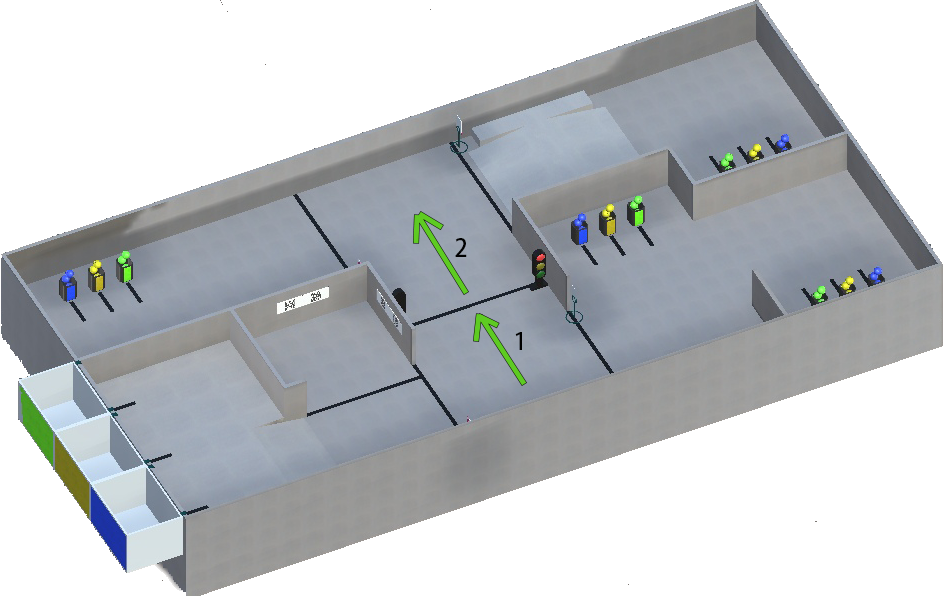
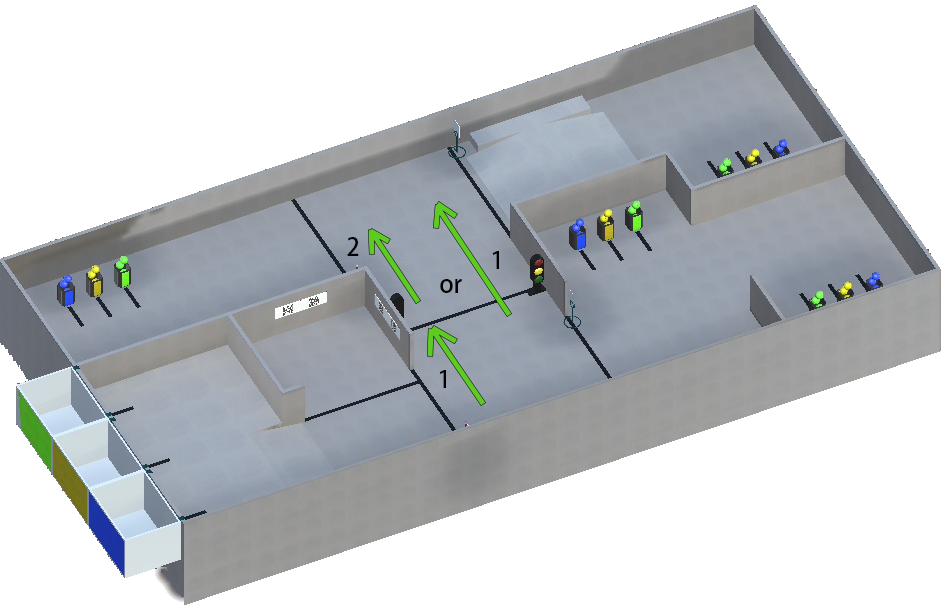
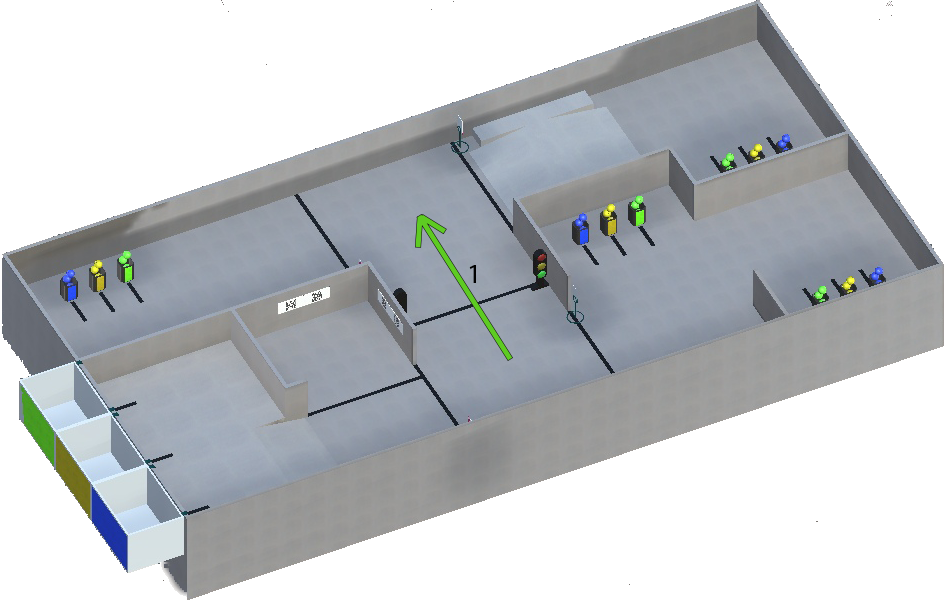

Светофоры
======================================

На поле есть два светофора, которые имеют три разных цвета (ожидаемо):

- **Красный** цвет (5 секунд)
- **Желтый** цвет (2 секунды)
- **Зеленый** цвет (8 секунд)

Красный:
"""""""""""""""""""""""""""""""
Робот должен остановиться перед черной линией, если горит **красный** свет. И продолжать движение, если загорелся **зеленый** свет:

Желтый:
"""""""""""""""""""""""""""""""

Робот должен остановиться перед черной линией, если горит **желтый** свет. И продолжать движение, если загорелся **зеленый** свет.
**Но**, если робот уже пересекает черную линию, в то время как загорелся **желтый**, он должен продолжить свое движение:

Зеленый:
"""""""""""""""""""""""""""""""

Робот должен двигаться, если на светофоре горит **зеленый**:

