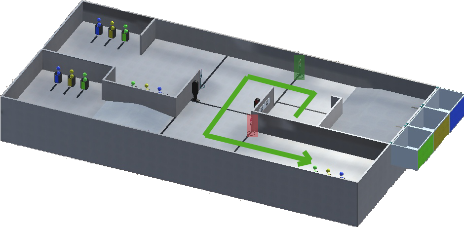
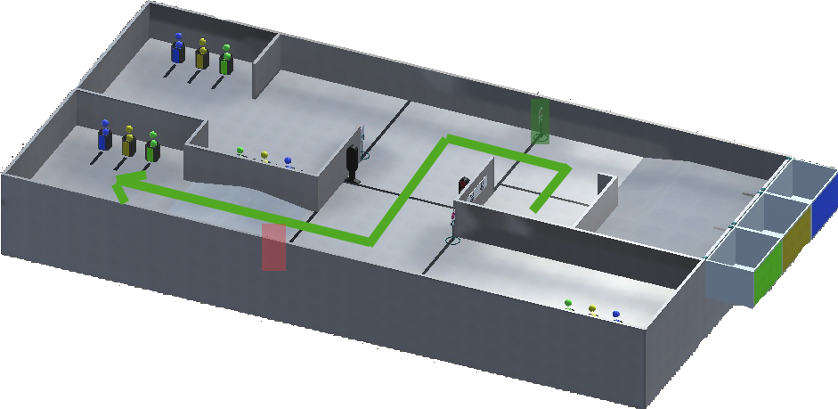
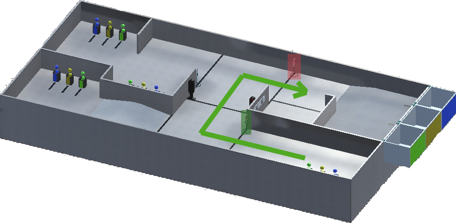
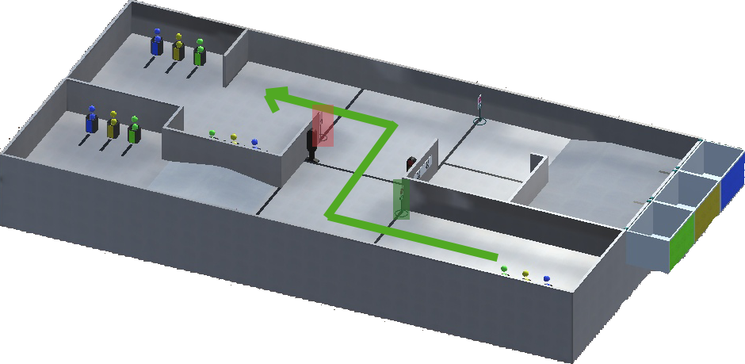
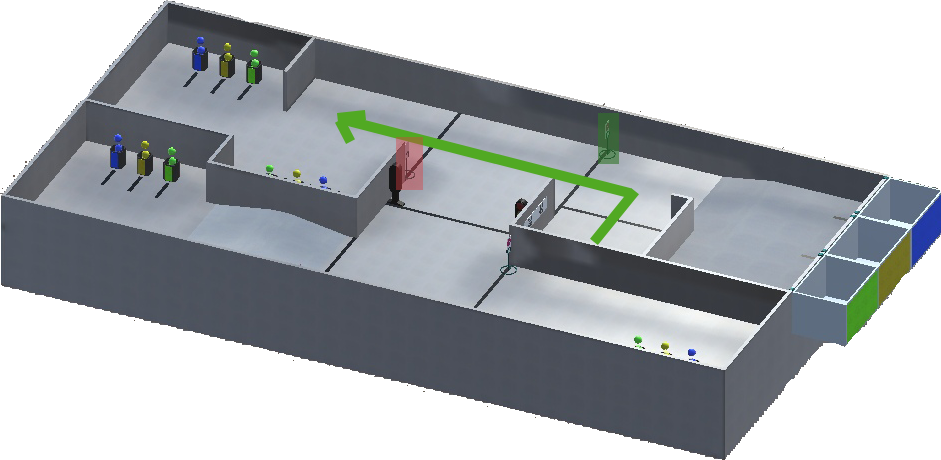
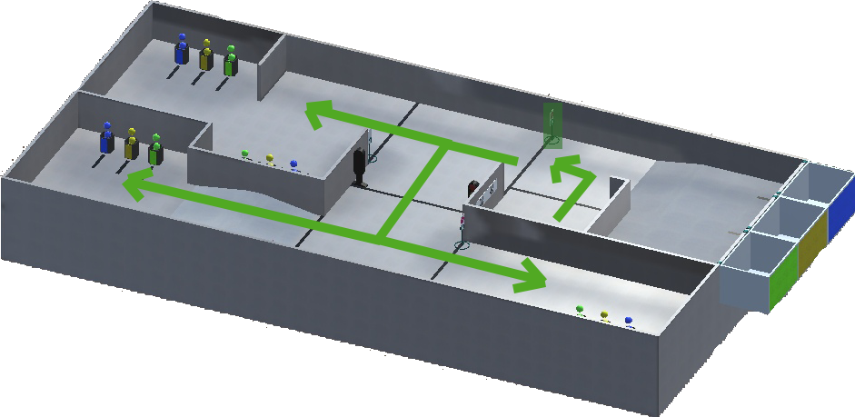
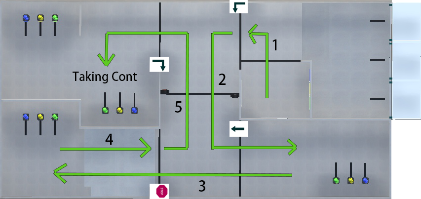
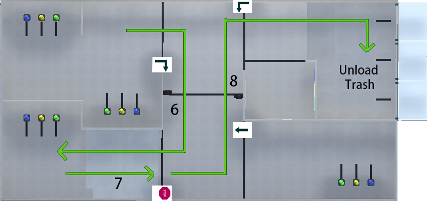

Дорожные знаки
======================================

Всего может быть четыре вида знаков:

- **Поворот налево**
- **Поворот направо**
- **Движение прямо**
- **Знак стоп**

Поворот налево:
""""""""""""""""""""""""""""""""

Например, если у вас знак **Поворот налево** около зоны старта (зеленый прямоугольник), вы должны двигаться как показано на рисунке:

или так:

и проверить следующий знак (красный прямоугольник), если это необходимо.

Поворот направо:
""""""""""""""""""""""""""""""""

Например, если в Maple Lane стоит знак **Поворот направо** (зеленый прямоугольник), вы должны двигаться как показано на рисунке:

или так:

и проверить следующий знак (красный прямоугольник), если это необходимо.

Движение прямо:
""""""""""""""""""""""""""""""""

Например, если у вас знак **Движение прямо** около зоны старта (зеленый прямоугольник), вы должны двигаться как показано на рисунке:

и проверить следующий знак (красный прямоугольник), если это необходимо.

Знак стоп:
""""""""""""""""""""""""""""""""

Например, если у вас **Знак стоп** около зоны старта (зеленый прямоугольник), вы должны остановиться перед знаком (или черной линией) и подождать минимум 2 секунды. После этого вы можете продолжить свое движение в любом направлении. Пример:

Все примеры:
""""""""""""""""""""""""""""""""

Вот пример движений робота, если ему нужно взять контейнер (контейнеры) из зоны Accorn Court:

