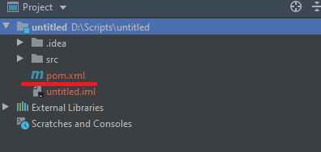
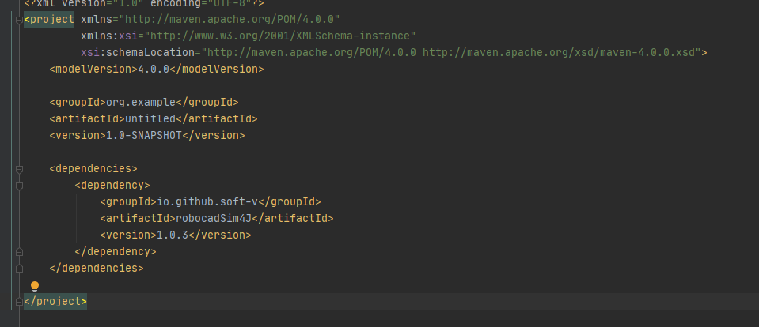
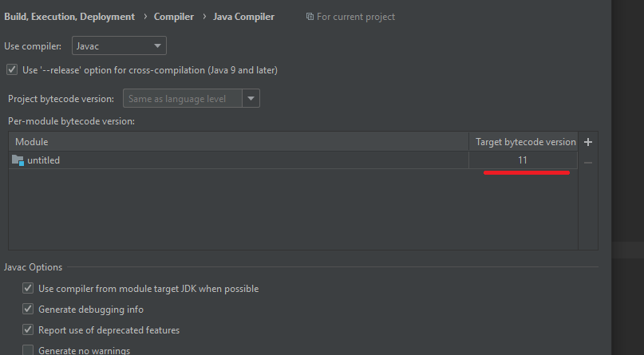

Java
======================================

Здесь вы можете найти информацию о том, как установить Java библиотеку для robocadV.

Первый способ (Maven):
^^^^^^^^^^^^^^^^^^^^^^^^^^^^^^^^^^^^^^^^^^^^^^^^^^^^^^^^^^^^^^^

1. Откройте свой проект Maven в IntelliJ -> откройте файл **pom.xml**:

2. Добавляем следующие строчки в этот файл (Рекомендуется использовать самые последнии версии библиотеки, вот список всех  `версий <https://github.com/Soft-V/robocadSim4J/blob/main/CHANGELOG.md>`__): 

      .. code-block:: java
         :linenos:

         <dependencies>
            <dependency>
               <groupId>io.github.soft-v</groupId>
               <artifactId>robocadSim4J</artifactId>
               <version>1.0.3</version>
            </dependency>
         </dependencies>
  

чтобы выглядело примерно так:

3. Также лучше всего использовать 11 версию SDK и 11 версию языка (вы можете проверить это в **File** -> **Project Structure**). И еще лучше иметь 11 версию байткода на выходе, для этого нужно перейти в **File** -> **Settings...** -> **Build, Execution, Deployment** -> **Compiler** -> **Java Compiler**:

4. Теперь вы можете программировать виртуальных роботов, используя Java (Maven)!
