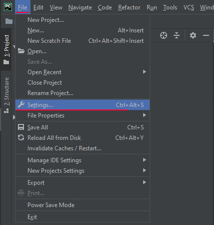
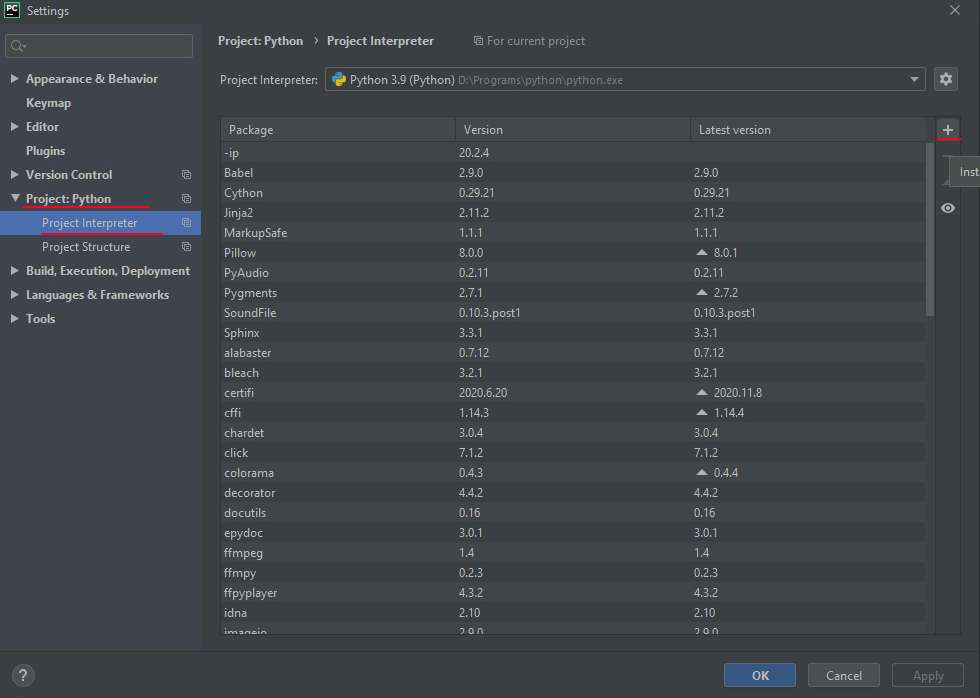
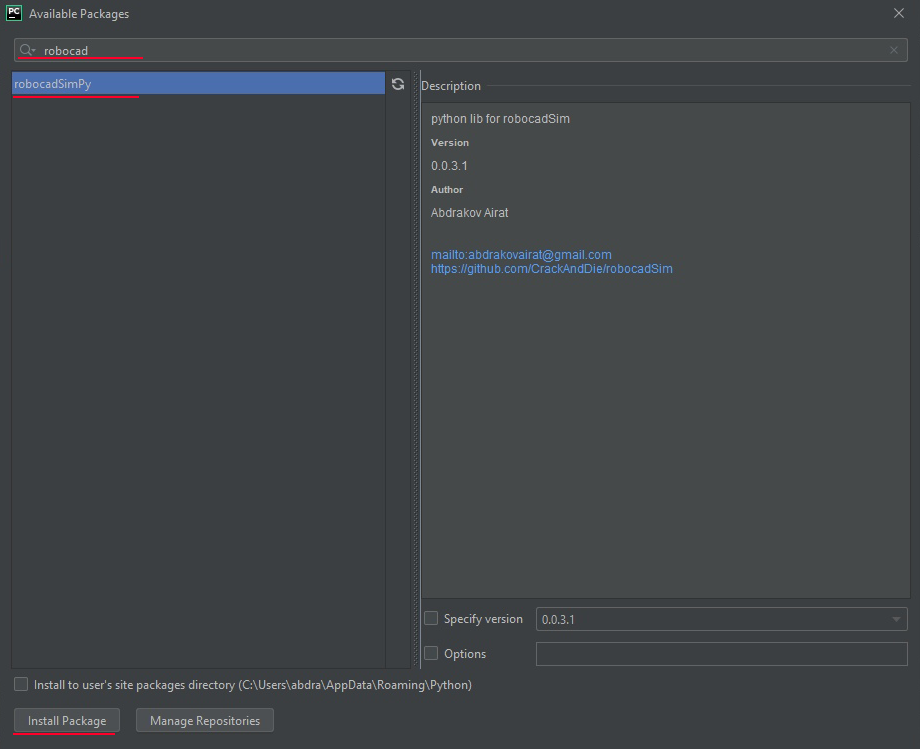
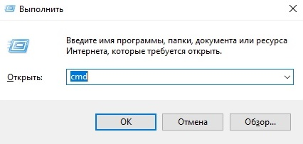
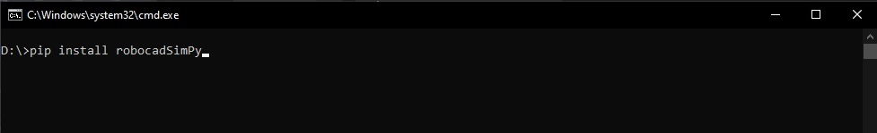
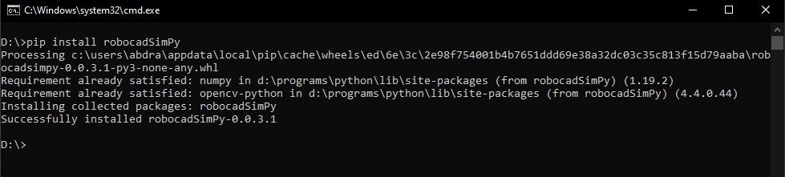

Python
======================================

Здесь вы можете найти информацию о том, как установить Python библиотеку для robocadV.

Первый способ:
^^^^^^^^^^^^^^^^^^^^^^^^^^^^^^^^^^^^^^^^^^^^^^^^^^^^^^^^^^^^^^^

1. Откройте PyChram -> нажмите на **File** -> **Settings**

2. Далее **Project: Python** -> **Project Interpreter** -> **Install** (Кнопочка с плюсиком)

3. Наберите **robocadSimPy** в **Поисковой строке** -> выберите **robocadSimPy** -> и нажмите **Install Package**

4. Теперь вы можете программировать виртуальных роботов, используя Python!

Второй способ (нужен предустановленный Python):
^^^^^^^^^^^^^^^^^^^^^^^^^^^^^^^^^^^^^^^^^^^^^^^^^^^^^^^^^^^^^^^

1. **Win + R** -> наберите **cmd** -> и нажмите **Enter**

2. Напишите **pip install robocadSimPy** или **pip3 install robocadSimPy** -> нажите **Enter**

3. Теперь вы можете программировать виртуальных роботов, используя Python!